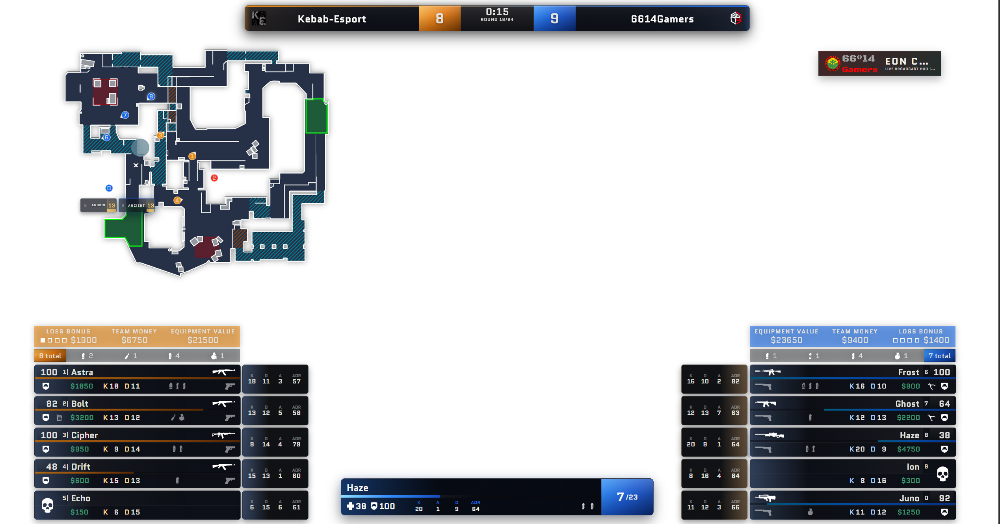
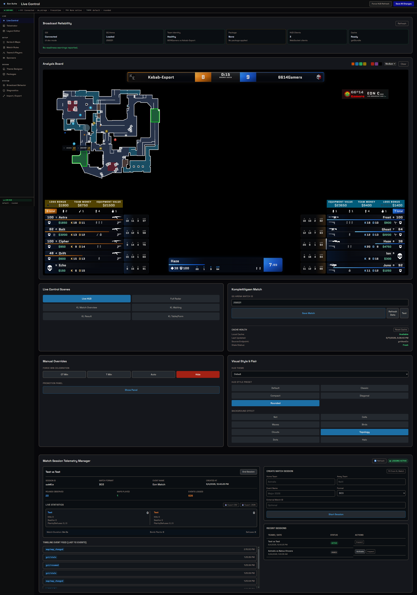
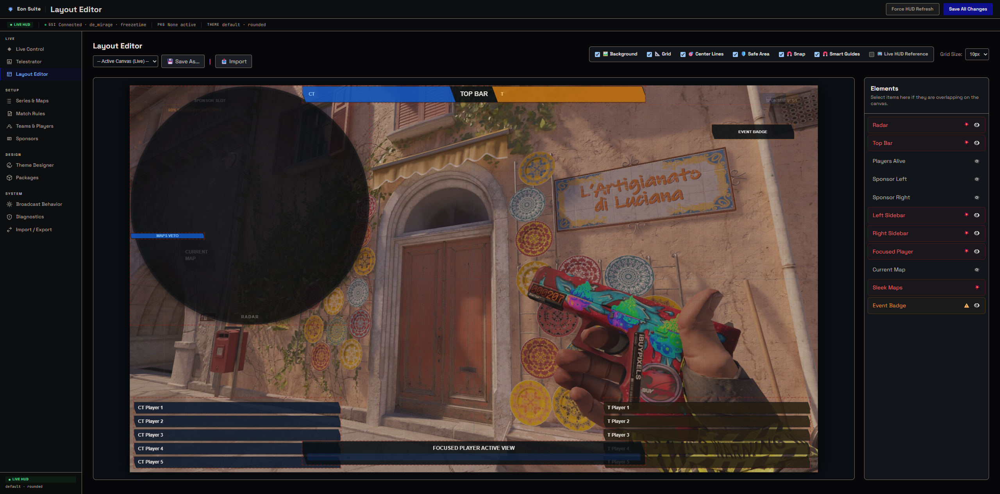
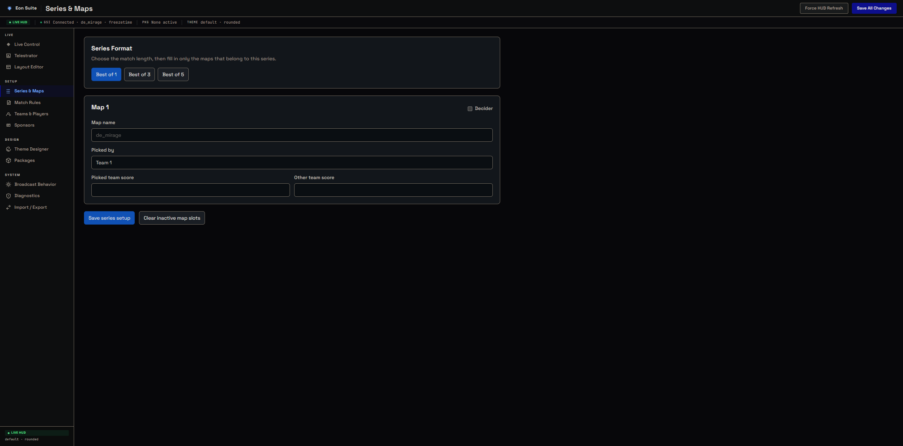
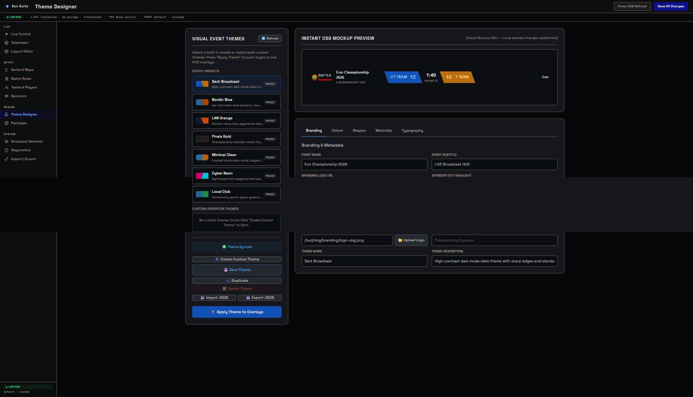

# Eon

Eon is a broadcast HUD for Counter-Strike 2 — the on-screen overlay you see on a tournament stream: team scores, round timer, player health/economy sidebars, a live radar, win probability, and sponsor/intermission scenes. It is built for LAN productions, online leagues, and observer stations where a caster or producer runs the broadcast from a control panel while OBS or vMix captures the overlay.



Everything runs locally. CS2 pushes live match data to Eon over Valve's Game State Integration (GSI); Eon enriches that state (win probability, economy metrics, caster alerts, highlight detection) and streams it over websockets to three surfaces:

- **HUD** (`/hud`) — the viewer-facing overlay, rendered as a transparent browser page you capture in OBS/vMix or launch as a click-through Electron window
- **Control panel** (`/config`) — a Vue SPA for the operator: switch scenes, set up the series and teams, override scores, run the telestrator, manage sponsors, and tune HUD layout/options live
- **Radar** (`/radar`) — a standalone top-down map view with player positions, usable as its own source

No remote services are required for normal operation — the only optional network dependency is the Komplettligaen league integration, which pulls match/table data from GG Arena to drive intermission scenes (match intro, halftime, results, league analytics).

## Features

- Live match HUD driven by CS2 GSI at ~20Hz: scores, timers, player cards, utility, economy, bomb/defuse states
- Five visual presets in the default theme: Slanted, Classic, Compact, Diagonal, and Rounded
- Win-probability model with on-air probability swing highlights and caster alerts
- Operator live controls: scene switching, telestrator drawing, team/score overrides, series (BO1/BO3/BO5) setup, match rules, sponsor rotation, layout editor, and HUD options
- Standalone radar with per-map calibrated backgrounds (in-game, legacy, and SimpleRadar styles)
- League intermission scenes (intro / halftime / fulltime / analytics) backed by Komplettligaen data
- Theme system with override chain `userspace -> default -> raw`: operator customizations live in `userspace`, the broadcast look in `default`, and the GSI parser/websocket foundation in `raw`
- Electron launchers for overlay, config, and radar windows
- UI dev mode that serves a frozen in-round state so you can work on layout without CS2 running

## Control Panel

The operator drives the broadcast from the config SPA at `/config`:

**Live Control** — broadcast readiness, live match preview, scene switching, telestrator, and Komplettligaen match setup:



**Layout Editor** — position and toggle HUD elements:



**Series & Maps** — series format (BO1/BO3/BO5), map picks, and per-map scores:



**Theme Designer** — event theme presets, branding, colors, and typography, with live HUD preview:



## Quick Start

```powershell
npm install
npm start
```

Then copy `gamestate_integration_eon.cfg` into your CS2 `game/csgo/cfg` directory, restart CS2, and open `http://127.0.0.1:31982/config` to drive the broadcast. Add `http://127.0.0.1:31982/hud?transparent` as a browser source in OBS/vMix.

Useful scripts:

```powershell
npm start              # server only
npm run start:ui-dev   # server with static match state (no CS2 needed)
npm run overlay        # Electron HUD overlay window
npm run config         # Electron control panel window
npm run radar          # Electron radar window
npm run start:all      # server + overlay window
npm run start:broadcast # server + overlay + radar windows
npm run gsi:simulate   # replay simulated GSI data into the server
npm run theme:validate # sanity-check theme files
npm run test:smoke     # Playwright smoke tests
```

## Default URLs

- `http://127.0.0.1:31982/` — landing page
- `http://127.0.0.1:31982/hud` — broadcast HUD (`?transparent` for capture)
- `http://127.0.0.1:31982/config` — operator control panel
- `http://127.0.0.1:31982/radar` — standalone radar
- `http://127.0.0.1:31982/api/gsi/status` — GSI ingestion health
- `http://127.0.0.1:31982/api/komplettligaen` — league integration data

## GSI Setup

Copy `gamestate_integration_eon.cfg` into your CS2 `game/csgo/cfg` directory, then restart CS2.

The server accepts GSI on:

- `/gsi`
- `/api/gsi`

## Project Structure

- `src/server` contains the Koa server, GSI endpoints, websocket fanout, settings/theme loading, config routes, radar routes, and Komplettligaen integration
- `src/config` contains the Vue 3 operator SPA and shared websocket-backed store
- `src/radar` contains the standalone radar view
- `src/electron` contains the Electron overlay/config/radar launchers
- `src/themes/raw` contains the base parser, websocket client, and raw theme foundation
- `src/themes/default` contains the active broadcast HUD theme, presets, assets, and intermission scenes
- `src/themes/userspace` is generated/used for local operator overrides
- `public` contains static public assets
- `docs` contains bundled reference documentation

## Local Customization

- Built-in theme settings live in `src/themes/default/theme.json`
- Local operator overrides live in `src/themes/userspace`
- Uploaded HUD fonts are stored under `src/themes/userspace/fonts`
- Komplettligaen config is stored separately in `src/themes/userspace/komplettligaen.json`
- The active HUD theme chain is `userspace -> default -> raw`

## Environment

The server and Electron launchers support:

- `HOST`
- `PORT`
- `GSI_TOKEN`
- `EON_UI_DEV_MODE`
- `UI_DEV_MODE`

## UI Dev Mode

Run `npm run start:ui-dev` to serve a static in-round match state without CS2.
The HUD, radar, and config UI still use the normal websocket and parser path, but live GSI posts are ignored so the layout stays stable while you work.

You can also enable it with `node . --ui-dev-mode` or `EON_UI_DEV_MODE=1`.
