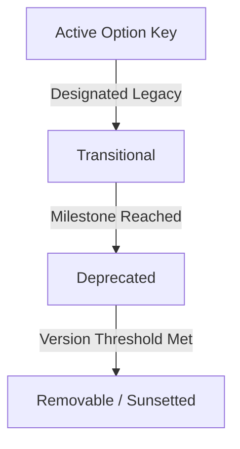

# Eon Configuration Migration & Deprecation Lifecycle

This document defines the architecture of Eon's configuration token system, migration boundaries, and the programmatic deprecation lifecycle.

---

## 1. Context & Goals

As Eon transitioned from legacy styling and layout variables to a cohesive, prefix-based token model (`layout.*`, `style.*`, `theme.*`), maintaining compatibility with existing, userspace-defined setups was paramount.

The core objectives of the configuration migration architecture are:
1. **Clean Canonical Schemas**: The active, canonical configurations must remain pure, highly readable, and free of deprecated flags or naming legacy bloat.
2. **Backward Compatibility**: Legacy aliases (e.g. `css.lan66-radar-top` mapped to `layout.radar.top`) must continue to load, resolve, and generate identical visual/CSS outputs.
3. **Programmatic Governance**: A systematic, alias-level deprecation lifecycle that enables developers to schedule legacies for eventual removal without accumulating permanent technical debt.
4. **Zero-Touch Auto-Migration**: The Config SPA and settings layers must silently read legacy structures, normalize them to canonical keys in-memory, and persist only canonical keys upon subsequent updates.

---

## 2. Deprecation Lifecycle Stages

Every legacy token alias transitions through a set of lifecycle stages:



| Stage | Description | System Behavior |
| :--- | :--- | :--- |
| **Active** | The canonical, modern token (e.g. `theme.shapes.radius`). | Standard resolution, UI editing, and persistence. |
| **Transitional** | A legacy alias actively mapped to a canonical key (e.g. `css.ui-radius`). | In-memory key mapping, CSS variable generation for both canonical and legacy, single-instance console warnings, and auto-migration on save. |
| **Deprecated** | Same behavior as transitional, but marked for deprecation with specific warning triggers pointing to a sunset target. | Programmatically retrievable via auditing helpers; logs prominent warning alerts on config load/import. |
| **Removable** | Legacy key has crossed the designated removal version threshold. | Subject to complete removal from the code. Checked via helper queries. |

---

## 3. Token Definition Schema

Lifecycle metadata is declared directly on the legacy aliases inside the respective theme option slice (located in `src/themes/raw/core/option-slices/`). The canonical option itself remains clean.

### Schema Spec
```javascript
{
  canonical: 'layout.radar.top',
  aliases: ['css.lan66-radar-top'],
  cssVars: ['--layout-radar-top', '--lan66-radar-top'],
  fallback: '1.5rem',
  lifecycle: {
    introducedIn: 'v1.5.0',
    canonicalSince: 'v1.5.0',
    aliases: {
      'css.lan66-radar-top': {
        status: 'transitional',
        sunsetPhase: 'Phase 3B',
        removeAfter: 'v2.0.0'
      }
    }
  }
}
```

> [!NOTE]
> Options that do not have any legacy aliases do not require a `lifecycle` block, keeping the definition slices lean and readable.

---

## 4. Governance & Auditing APIs

The helper module `src/server/helpers/canonical-map.js` dynamically crawls all option slices on server startup and exports programmatic queries for lifecycle audits:

### `getDeprecatedAliases()`
Returns a flat dictionary mapping all active legacy alias keys to their lifecycle metadata and canonical targets.
* **Returns**: `Object`

```json
{
  "css.ui-radius": {
    "canonical": "theme.shapes.radius",
    "introducedIn": "v1.5.0",
    "canonicalSince": "v1.5.0",
    "status": "transitional",
    "sunsetPhase": "Phase 3B",
    "removeAfter": "v2.0.0"
  }
}
```

### `getSunsetCandidates(targetRelease)`
Filters the deprecated aliases and returns those scheduled for removal on or before the specified release version.
* **Arguments**: `targetRelease` (String, e.g. `'v2.0.0'`)
* **Returns**: `Object` (filtered subset of `getDeprecatedAliases()`)

---

## 5. Telemetry & Warnings

When legacy keys are processed during startup, settings resolution, or layout preset imports, Eon triggers a one-time server warning:

1. **Deduplicated Execution**: Tracked using an in-memory `Set` (`warnedLegacyKeys`) to ensure each deprecated option prints only once in the console, preventing log spam.
2. **Actionable Resolution**: The telemetry message explains the deprecation phase, states the sunset version, and provides actionable guidance to the operator:

```
[Deprecation Warning] Legacy configuration alias "css.ui-radius" is transitional/deprecated.
 Please update to the canonical key "theme.shapes.radius".
  - Lifecycle: introduced in v1.5.0, canonical since v1.5.0
  - Sunset: phase "Phase 3B", scheduled for removal in version "v2.0.0"
  - To resolve: Save your configuration in the Config SPA to automatically migrate userspace keys to canonical equivalents.
```

---

## 6. Developer Playbook: Deprecating a Token

To deprecate a legacy setting and replace it with a canonical one:

1. **Create the canonical key**: Choose a standard prefix-based path (`layout.*`, `style.*`, `theme.*`).
2. **Define it in the appropriate option slice**: Add the definition containing the `canonical` key, the legacy keys in `aliases`, and the dual CSS variables.
3. **Declare the `lifecycle` metadata**: Specify the introduction version and target sunset versions for the aliases.
4. **Implement UI changes**: Update Config SPA files (e.g. `OptionsEditor.vue`, `LayoutEditor.vue`) to bind only to the new `canonical` key.
5. **Verify**: Run the server and ensure that when legacy options are loaded from `userspace/theme.json`, the console prints the deprecation warning, and saving from the Config SPA removes the legacy alias completely from disk.
