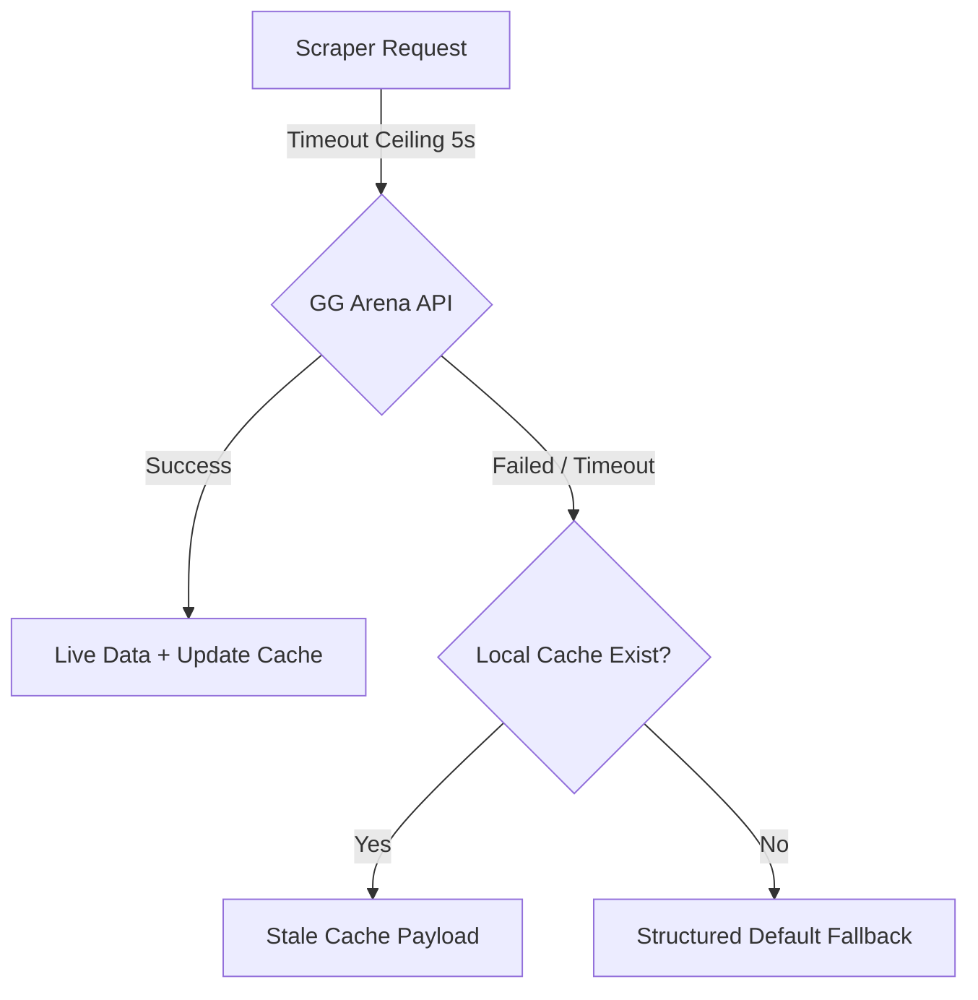

# Eon Offline Tournament Resilience & Caching Architecture

This document defines Eon's tournament resilience model, guaranteeing clean HUD rendering continuity and server stability during offline LAN environments, API outages, or GG Arena downtime.

---

## 1. Caching Model Overview



To prevent unhandled exceptions, network timeouts, or partial payloads from breaking caster graphics, Eon operates under a strict priority model: **Overlay continuity is always a higher priority than data freshness.**

---

## 2. Local Cache Layer (`userspace/cache/`)

Data is persisted on disk inside `userspace/cache/` using flat-file mapping matrices:

- **`komplettligaen.json`**: Caches the completely resolved match bundle state (used as the ultimate fallback backup).
- **`matches.json`**: A JSON map pairing `matchId` to simplified match records.
- **`standings.json`**: A JSON map pairing `divisionKey` to standings standings table records.

### Envelope Schema:
```json
{
  "savedAt": "2026-05-23T10:48:00.000Z",
  "source": "scrapeMatch",
  "schemaVersion": "1.0.0",
  "payload": { ... }
}
```

---

## 3. Scraper Timeout Policy & Fail-Safe Retries

Scraper fetch requests to GG Arena (`src/server/komplettligaen.js`) include a hard request timeout ceiling:

- **Timeout Limit**: `5000ms` (5 seconds).
- **Behavior**: If the network request takes longer than 5 seconds or fails immediately, the promise is rejected, and Eon fails fast into cache fallback mode instead of hanging live HTTP requests.
- **Error Boundaries**: Cache read and write calls are enclosed in separate `try/catch` scopes. If a write call fails, Eon prints a console warning but continues serving the active request cleanly.

---

## 4. Structured Default Fallbacks (`src/server/fallbacks/`)

If a tournament match has never been loaded (no cached record exists) and the network is completely down, Eon serves mock placeholder structures from `payload-fallbacks.js`.

These objects mimic authentic API shapes:
- **Match Placeholders**: Sets team names to `"Home Team"` and `"Away Team"`, sets logo paths to native CT/T assets (`/hud/img/logos/ct.png`), and supplies complete empty stats arrays.
- **Empty Standings**: Returns a clean standings object containing empty arrays so that Vue `v-for` iterators do not crash on null properties.

---

## 5. Operations Panel Cache Diagnostics

The unified Config SPA dashboard (`http://localhost:31982/config/`) provides deep operator diagnostics for the persistence layer:

- **Cache Health Status**: Shows if local caches are `Available` or `Missing`.
- **Last Updated Time**: Standard formatted local time string of the last successful scrape.
- **Stale Status Indicator**: Marks caches older than 5 minutes as `Stale (N min)` in orange, or `Fresh` in green.
- **Scraper Error logs**: Renders a dedicated alert box displaying the exact network exception (e.g. `ENOTFOUND` or `timed out`) on fetch failures.
- **Reset Cache Handler**: An explicit control to reset and purge all tournament cache files on disk.
