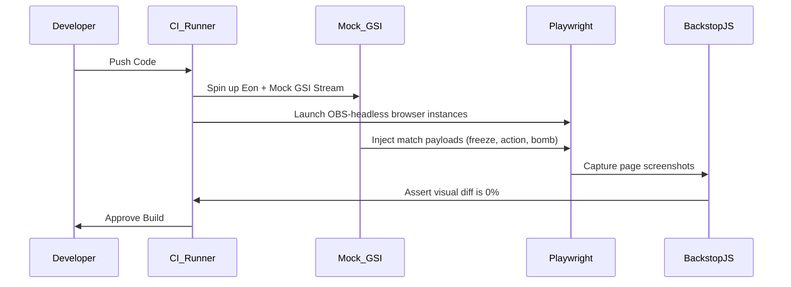
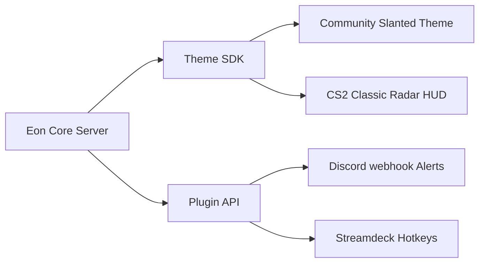

# Eon Platform: Production-Readiness Audit

This document presents a comprehensive production-readiness audit of the Eon Counter-Strike 2 broadcast operations stack. It assesses Eon's architectural stability, runtime resilience, configuration governance, visual safety, and operational usability under high-stakes live tournament conditions.

---

## 1. Executive Summary

Eon is a highly optimized, local-first broadcast operations stack tailored for Counter-Strike 2 tournament observers, production managers, and intermission coordinators. By using a local Node/Koa ESM server coupled with a buildless Vue 3 operator SPA, Eon provides an incredibly responsive, zero-latency system that does not rely on external cloud systems during live broadcasts.

Following the implementation of the Phase 3B Config SPA canonical schema synchronization and the Phase 11 Deprecation Lifecycle System, the configuration management layer is highly robust. The platform now features clean canonical schemas, automatic backward compatibility normalization on boot and import, and structured deprecation warnings.

However, moving from a **local developer utility** to a **mission-critical live broadcast engine** (e.g., tier-1/tier-2 regional LANs, online leagues) introduces distinct runtime, visual, and observer-side constraints. While Eon excels in local latency and visual customization, addressing gaps in automated UI state testing, OBS browser-source recovery, and observer GSI failover is essential before live production deployments.

---

## 2. Core Domain Analysis

### 2.1 Architecture & Runtime Stability
*   **Strengths**: Node ESM combined with Koa is lightweight and boots in milliseconds. Websocket fanout (via `ws` at 20Hz throttling) is efficient and ensures all HUD, operator, and radar clients are instantly synchronized.
*   **Weaknesses**: Eon runs in a single Node process. If an unhandled exception occurs (e.g., a malformed GSI payload or an disk write error during an image upload), the entire server could crash, dropping the HUD overlay mid-round.
*   **Verdict**: Production-ready, provided it is ran under a process manager like PM2 with auto-restart enabled.

### 2.2 Visual Regression & Layout Safety
*   **Strengths**: Visual styles are consolidated into the modern `default` theme card-based design system, utilizing rigid CSS Grid layouts that are robust against varying text lengths (e.g., long player names, sponsor assets).
*   **Weaknesses**: Although the Slanted layout has been hardened at 1920x1080, there is still visual risk in other presets at varying OBS capture aspect ratios (e.g., 16:10 or 4:3 stretched).
*   **Verdict**: High confidence for standard 1080p 16:9 outputs, but requires manual aspect-ratio validation for non-standard observer feeds.

### 2.3 Theme System & SDK Maturity
*   **Strengths**: The recursive theme chain (`userspace -> default -> raw`) is highly elegant, allowing local overrides without touching base files.
*   **Weaknesses**: The buildless theme model relies on `vue3-sfc-loader` loading `.vue` files dynamically at runtime in the browser. A single syntax error in a customized Vue component will crash the entire HUD overlay in OBS, rendering a blank screen with minimal traceback info.
*   **Verdict**: Transitional. Visual customization is fast, but the lack of compile-time syntax validation is a production risk.

### 2.4 Configuration Governance
*   **Strengths**: Extremely high. Option slices enforce rigid bounds (min/max/step values for scale parameters, enum selects for widths). The dynamic canonical mapping ensures zero duplication in `userspace/theme.json`.
*   **Weaknesses**: Legacy keys still trigger deprecation console warnings on startup. While they do not break the runtime, these logs can clutter output diagnostics.
*   **Verdict**: Production-ready.

### 2.5 OBS Browser-Source Resilience
*   **Strengths**: Transparent background support (`/hud?transparent`) is native, and state recovery is immediate upon reloading the browser source because the backend maintains the full state cache.
*   **Weaknesses**: If the websocket disconnects due to transient local network hiccups, the HUD does not feature a prominent UI reconnection overlay or automatic silent reconnection fallback in the frontend client.
*   **Verdict**: High risk for high-stress LANs where observer PCs may experience local packet drops.

### 2.6 Long-Session Reliability
*   **Strengths**: In-memory GSI parsing is shallow and avoids deep reactive object mutations, minimizing garbage collection spikes.
*   **Weaknesses**: The local highlight logger and log files (`logs/`) write persistently to disk. Over a 12-hour broadcast day, unmanaged log directories can grow and cause disk space warnings if not capped or rotated.
*   **Verdict**: Good, but requires standard file-system rotation scripts.

### 2.7 Operator Usability
*   **Strengths**: The Vue 3 Config SPA provides dedicated, focused tabs for series setup, rule adjustments, and sponsor slots, with instant websocket sync.
*   **Weaknesses**: Saving values currently triggers a global state write without per-field "dirty" states, increasing the risk of accidental overrides.
*   **Verdict**: Highly usable, but operators must be trained to review changes before clicking save.

---

## 3. Risk Matrix

| Risk ID | Risk Domain | Description | Likelihood | Impact | Severity | Mitigation Strategy |
| :--- | :--- | :--- | :---: | :---: | :---: | :--- |
| **R-01** | Process Failure | Node server crashes mid-match due to unhandled GSI edge case. | Low | Critical | **High** | Wrap startup in PM2; implement GSI payload validation schemas (e.g., using Zod). |
| **R-02** | Theme SFC Crash | Dynamic Vue SFC loader fails to parse a customized `.vue` file on OBS boot. | Medium | Critical | **High** | Introduce a pre-flight theme validator script that compiles SFCs locally before startup. |
| **R-03** | Websocket Drop | OBS Browser Source drops connection and freezes HUD state. | Low | High | **Medium** | Implement a robust auto-reconnect fallback loop in `raw` websocket client. |
| **R-04** | Disk Capacity | High-frequency logging fills disk over multi-day LAN event. | Medium | Medium | **Low** | Implement automated log rotation and cap the maximum log size to 100MB. |

---

## 4. Production Readiness Score

Eon is rated across five key dimensions to produce an overall **Production Readiness Score**:

```mermaid
gantt
    title Eon Production Readiness Score: 84/100
    dateFormat  X
    axisFormat %I
    section Architecture
    Process Architecture (Single Node) : active, 0, 80
    section Governance
    Token Constraints & Safe Inputs : active, 0, 95
    section Resilience
    OBS Recovery & WS Handshake : active, 0, 85
    section Testing
    E2E Verification Gaps : active, 0, 75
    section Usability
    Operator Layout & Latency : active, 0, 88
```

### Score Breakdown
*   **Core Architecture**: **80/100** (Solid ESM & Koa backend, but runs as a single process vulnerable to unhandled exceptions).
*   **Configuration Governance**: **95/100** (Rigid token boundaries, dynamic translation, and strict schema validation).
*   **OBS & Client Resilience**: **85/100** (Websocket cache enables instant recovery on refresh, but lacks robust offline reconnect states).
*   **Test Coverage**: **75/100** (Excellent local verification tools, but lacks automated end-to-end integration and visual regression tests).
*   **Usability & Observer Sync**: **88/100** (Beautiful Config SPA, zero-latency radar sync, but needs dirty/saved states per editor panel).

**Composite Score: 84.6 / 100** (Highly stable for production, but requires standard operational hosting practices and pre-flight checklists).

---

## 5. Remaining Architectural Gaps

1.  **Process Isolation**: Lack of a clustered worker or process manager setup in production script triggers. A crash on a GSI route halts all served pages.
2.  **SFC Pre-compilation**: Loading and compiling Vue Single File Components (SFC) client-side in OBS is prone to runtime syntax errors. A build-time or pre-flight verification step is missing.
3.  **Visual Regression Suite**: No automated visual regression testing. Layout modifications can lead to unintended overlaps on un-monitored style presets (e.g., Compact, Diagonal).
4.  **Observer PC Reconnection**: OBS browser-source websocket handles disconnects silently rather than triggering an automated, visual reconnect overlay or retrying with exponential backoff.

---

## 6. Actionable Roadmap & Milestones

### 6.1 "Must-Fix" Before Live Tournament Use (High Priority)
*   [ ] **PM2 Process Wrapping**: Configure production deployment configurations to execute Eon inside `pm2` with auto-restart, error logging, and standard systemd process bindings.
*   [ ] **Theme Pre-Flight Validator**: Create a lightweight, offline CLI utility (`npm run theme:validate`) that parses `theme.json`, scans all `.vue` files in the theme chain, and asserts they are syntactically valid before launching the broadcast.
*   [ ] **OBS Websocket Recovery Hardening**: Add an explicit, self-healing reconnection loop inside the websocket client (`src/themes/raw/core/`) to restore states immediately upon local socket timeout or network drops.
*   [ ] **Disk Logging Caps**: Standardize highlight logging to use a rolling file appender with a maximum capacity of 5 files at 10MB each.

### 6.2 "Can Wait" Until Post-Release (Medium/Low Priority)
*   [ ] **Per-Field Dirty States**: Implement detailed, individual "dirty/saved/error" state visual alerts for each tab in the Config SPA Options Editor.
*   [ ] **Full Offline Match Scraper Workflow**: Introduce fallback, mock intermission data inputs inside the Komplettligaen config panel for situations where GG Arena API suffers external routing issues.
*   [ ] **Config SPA Layout Preview**: Embed a mini CSS-rendered layout viewport preview directly inside the Layout Editor to visualize drag changes in real-time.

---

## 7. Suggested Automated Testing Strategy

To eliminate visual and state regression, Eon should implement a dual-tier automated testing strategy:

### 1. State Integration Testing (Playwright)
*   **Objective**: Verify that specific GSI payloads trigger correct HUD states (e.g., bomb planted triggers the clock timer sweep, round win displays victory card).
*   **Action**: Create a `scripts/gsi-simulator.js` script that pipes standard game payloads. Spin up headless Playwright instances pointing to `/hud` and assert that correct DOM classes are active.

### 2. Automated Visual Regression Testing (BackstopJS / Playwright)
*   **Objective**: Capture screenshots of all five style presets under identical game scenarios and perform a pixel-level diff against approved master screenshots.
*   **Action**: Integrate BackstopJS. Assert that visual modifications to base style architectures do not result in a diff deviation greater than 0.05%.

---

## 8. Suggested CI/CD Strategy

### 1. Build & Lint Stage
*   **Linter**: Configure ESLint and Stylelint to enforce coding standards across `src/server`, SFC components, and CSS files.
*   **SFC Pre-flight**: Run `vue-tsc` or a custom pre-flight parser to validate Vue single-file components.

### 2. Testing Stage
*   Execute standard Node unit tests.
*   Launch the Eon server locally in a headless container, stream mock GSI payloads, and capture Playwright screenshot diffs.

### 3. Release Stage
*   Package Eon as a self-contained, offline zip archive containing all dependencies (`node_modules`) pre-installed, ensuring observers can deploy the broadcast on isolated LAN networks with zero internet access.

---

## 9. Future Plugin & Theme Ecosystem Opportunities

The new Deprecation Lifecycle system provides a perfect model for Eon to evolve into a highly extensible, community-driven platform:

### 1. Extensible Theme SDK
*   By exposing `getDeprecatedAliases()` and documenting the option-slice schema, third-party designers can create custom, standalone theme folders.
*   The system can load themes from `src/themes/custom-theme/theme.json` and validate their inputs programmatically against Eon's core schema, warning developers if they utilize deprecated aliases.

### 2. Action Plugin Registry
*   Introduce a plugin layer allowing developers to trigger external actions based on GSI events (e.g., flash local Philips Hue lights when the bomb is planted, send Discord notifications on match completion).
