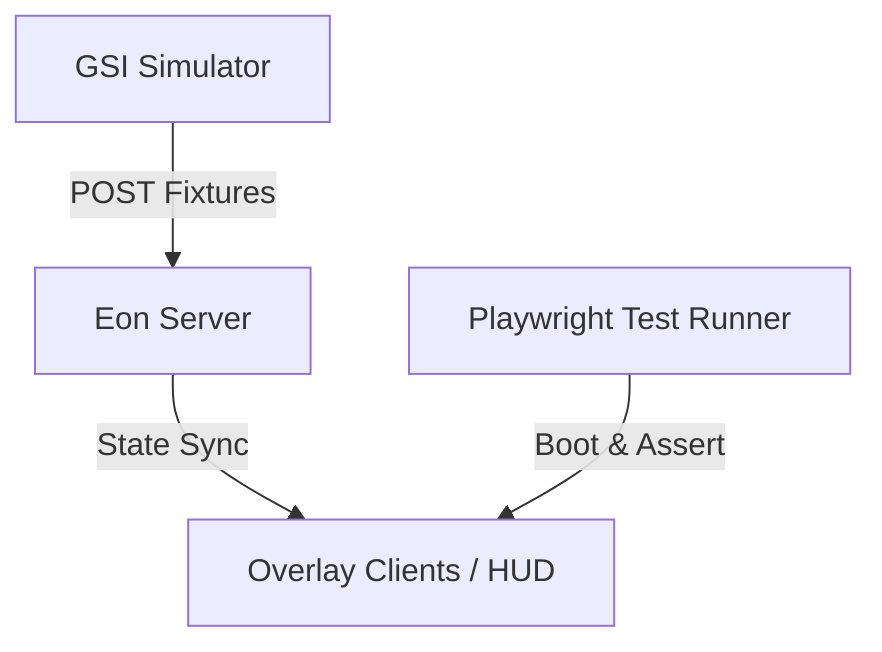

# Eon Visual Regression & Smoke Testing System

This document outlines Eon's automated verification framework, combining built-in Playwright smoke tests and the CS2 GSI simulated telemetry suite.

---

## 1. Architecture Overview



---

## 2. GSI Simulation Suite

Eon includes a high-fidelity CS2 GSI game state simulator located in `scripts/gsi-simulator.js`. This script acts as a mock CS2 client, posting standard payloads to Eon's endpoints without requiring a live game process.

### Included Fixtures (`tests/fixtures/gsi/`)
- `freezetime.json`: Represents standard round freezetime, resetting team money states and observer grids.
- `live.json`: Standard mid-round combat state with active player health degradation and weapon setups.
- `bomb-planted.json`: Planted bomb ticking down on site, triggering win probability recalculations.
- `round-over.json`: Simulates round endings, logging clutch metrics and tracking MVPs.

### Simulating Broadcast Playback
To run a continuous loop sequence playing back all round states in order (every `3000ms`):
```bash
npm run gsi:simulate -- --interval 3000
```

---

## 3. Automated Smoke Testing

Eon uses Playwright to verify page stability and reactive state translations across core interfaces.

### Playwright Config (`playwright.config.js`)
Configured to automatically orchestrate Eon's server in isolated UI dev mode on port `31982` before launching browser instances, ensuring offline-safe execution.

### Test Coverage
1. **HUD Smoke (`tests/playwright/hud-smoke.spec.js`)**:
   - Asserts HUD viewport renders correctly.
   - Confirms standby layouts render upon cold startup.
   - Verifies the websocket client status class binds successfully (`ws-connected`).
   - POSTs simulated GSI states and asserts HUD transitions cleanly from standby into live active layouts showing active maps.
2. **Config Smoke (`tests/playwright/config-smoke.spec.js`)**:
   - Navigates to `/config/`.
   - Confirms that Eon's unified Option SPA editor panels mount and load cleanly.

### Running Tests
Ensure Playwright is installed locally:
```bash
# Install browsers
npx playwright install chromium

# Run smoke tests
npm run test:smoke
```

---

## 4. Visual Regression Roadmap

The next phase of verification infrastructure will focus on full pixel-perfect visual regression:

1. **Screenshot Baseline Matrix**: Establish Chromium screenshot references for all standard presets (Slanted, Classic, Compact, Diagonal, Rounded).
2. **State Combinations**: Validate specific edge states (long team names, missing logo fallbacks, overtime scoring formats, and triple-digit ADR values).
3. **OBS Browser-Source Simulation**: Inject custom css variables mimicking OBS viewport overlays and assert correct bounding box limits.
4. **CI Artifact Archiving**: Upload failed regression diffs directly onto GitHub Actions artifacts for operator inspections.
