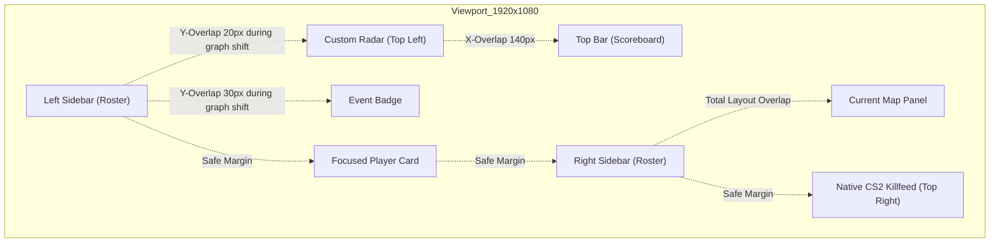

# Eon 1920x1080 Broadcast Layout Model & Hardening Audit - 2026-05-21

This document provides a highly precise, mathematical analysis of Eon's 1920x1080 coordinate layout grid, mapping out exact pixel boundaries, safety zones, collision overlaps, visual regressions, and surgical recommendations to guarantee layout defense on live OBS/Twitch 1080p outputs.

---

## 1. 1920x1080 Layout Coordinate Model

Eon locks its logical coordinate system to a standard **1920x1080px (16:9)** viewport using a CSS Container size query (`container-type: size`) on `.hud-stage`.
The viewport uses a dynamic root scale factor `1rem = 0.925925926vh`. At 1080px height:
$$\text{Scale Factor} = 0.925925926 \times \frac{1080}{100} = 10\text{px exactly}$$

Thus, **$1\text{rem} = 10\text{px}$** at $1080\text{p}$, allowing direct 1:1 pixel conversions.

### A. Screen Margins (Viewport Margin)
* **Default/Slanted/Classic**: 
  * Side Margin (`--viewport-margin-x`): $2\text{rem} = 20\text{px}$
  * Vertical Margin (`--viewport-margin-y`): $1.5\text{rem} = 15\text{px}$
* **Compact**:
  * Top Margin: $0.9\text{rem} = 9\text{px}$
  * Bottom Margin: $1\text{rem} = 10\text{px}$
  * Side Margin: $0\text{px}$ (sidebars are flush with the screen edges)

### B. Center elements
* **Top Bar (Teams & Score)**:
  * *Slanted/Default Preset*: Centered. Height: $46\text{px}$. Width: $62\% = 1190.4\text{px}$. Left: $19\% = 364.8\text{px}$. Top: $1.5\% = 16.2\text{px}$. (Horizontal span: $[365\text{px}, 1555\text{px}]$)
  * *Classic Preset*: Centered. Height: $46\text{px}$. Width: $48\% = 921.6\text{px}$. Left: $26\% = 499.2\text{px}$. Top: $1.05\% = 11.3\text{px}$. (Horizontal span: $[499\text{px}, 1421\text{px}]$)
  * *Compact Preset*: Centered. Height: $40.5\text{px}$ (scaled by $0.88$). Width: $42\% = 806.4\text{px}$. Left: $29\% = 556.8\text{px}$. Top: $0.9\% = 9.7\text{px}$. (Horizontal span: $[557\text{px}, 1363\text{px}]$)
* **Focused Player Card (Spectator HUD)**:
  * Placed at bottom-center. Height: $8.8\text{rem} = 88\text{px}$. Bottom offset: $1.5\text{rem} = 15\text{px}$ (Y footprint: $[15\text{px}, 103\text{px}]$).
  * *Slanted/Default Preset Width*: $46\% \text{ to } 50\% = 883.2\text{px} \text{ to } 960\text{px}$. (Horizontal span: $[480\text{px}, 1440\text{px}]$)
  * *Classic Preset Width*: $38\% = 729.6\text{px}$. (Horizontal span: $[595\text{px}, 1325\text{px}]$)
  * *Compact Preset Width*: $32\% = 614.4\text{px}$. (Horizontal span: $[653\text{px}, 1267\text{px}]$)

### C. Sidebar Player Lists
* **Slanted/Default Preset**:
  * Width: $44\text{rem} \text{ player card} + 0.5\text{rem} \text{ highlight} = 44.5\text{rem} = 445\text{px}$.
  * Left Sidebar: Starts at $20\text{px}$ margin. (Horizontal span: $[20\text{px}, 465\text{px}]$)
  * Right Sidebar: Starts at $20\text{px}$ margin from right. (Horizontal span: $[1455\text{px}, 1900\text{px}]$)
* **Classic Preset**:
  * Width: $29.9\text{rem} \text{ player card} + 0.5\text{rem} \text{ highlight} = 30.4\text{rem} = 304\text{px}$.
  * Left Sidebar: Starts at $20\text{px}$ margin. (Horizontal span: $[20\text{px}, 324\text{px}]$)
  * Right Sidebar: Starts at $20\text{px}$ margin from right. (Horizontal span: $[1596\text{px}, 1900\text{px}]$)
* **Compact Preset**:
  * Width: $24.7\text{rem} \text{ player card} + 0.25\text{rem} \text{ highlight} = 24.95\text{rem} = 249.5\text{px}$.
  * Left Sidebar: Flush left ($0\text{px}$). (Horizontal span: $[0\text{px}, 249.5\text{px}]$)
  * Right Sidebar: Flush right ($0\text{px}$). (Horizontal span: $[1670.5\text{px}, 1920\text{px}]$)

### D. Overlay Indicators & Offsets
* **Custom Radar**: Asp-ratio 1:1. Sits top-left. Top: $1.5\text{rem} = 15\text{px}$, Left: $2.5\text{rem} = 25\text{px}$ (at $1080\text{p}$).
  * *Slanted Width*: $25\% = 480\text{px}$. (Y-footprint: $[585\text{px}, 1065\text{px}]$)
  * *Classic Width*: $21\% = 403.2\text{px}$. (Y-footprint: $[665.4\text{px}, 1068.6\text{px}]$)
  * *Compact Width*: $18\% = 345.6\text{px}$. (Y-footprint: $[724.7\text{px}, 1070.3\text{px}]$)
* **Event Badge (Tournament Sponsor Label)**: 
  * Left: $1\text{rem} = 10\text{px}$. Width: calc(var(--radar-width) - 2rem) = $460\text{px}$ (Slanted) or $383.2\text{px}$ (Classic).
  * Top: calc(var(--radar-width) + 0.9rem) = sits exactly $9\text{px}$ below the custom radar box.
* **Current Map Panel**: Sits bottom-right. Width: $16\text{rem} = 160\text{px}$. (Horizontal span: $[1740\text{px}, 1900\text{px}]$). Bottom: $1.5\text{rem} = 15\text{px}$ (Y-footprint: $[15\text{px}, 55\text{px}]$).

---

## 2. Safe Zones and Collision Risks

By plotting these coordinates, we can isolate absolute spatial collision overlaps on the 1080p broadcast canvas:

### A. Left Side High-Risk Collisions
1. **Left Sidebar vs. Custom Radar (Slanted Preset)**:
   * Standard Left Sidebar height (5 players + equipment + grenades) = $402\text{px}$ high. Anchored at $15\text{px}$ bottom. Normal Y-footprint is $[15\text{px}, 417\text{px}]$.
   * When translated upwards by the Series Graph ($+188\text{px}$ translation), the top of the Left Sidebar shifts to **$605\text{px}$** high.
   * The custom radar's lower boundary sits at **$585\text{px}$** high.
   * **Collision**: Direct **$20\text{px}$ vertical overlap** and **$440\text{px}$ horizontal overlap** in Slanted mode when the graph is active!
2. **Left Sidebar vs. Event Badge (Slanted Preset)**:
   * The Event Badge Y-footprint sits at $[546\text{px}, 576\text{px}]$ directly under the radar.
   * Left Sidebar top card translated Y-footprint reaches $[203\text{px}, 605\text{px}]$.
   * **Collision**: Direct **$30\text{px}$ vertical overlap**! The Event Badge covers the first two player cards of the roster list.
3. **Custom Radar vs. Top Bar Scoreboard (Slanted Preset)**:
   * Slanted Custom Radar right edge is $25\text{px} + 480\text{px} = \mathbf{505\text{px}}$.
   * Slanted Top Bar left edge starts at $19\% = \mathbf{364.8\text{px}}$.
   * **Collision**: Direct **$140.2\text{px}$ horizontal overlap** in Slanted mode. The scoreboard overlaps the right portion of the minimap.

### B. Right Side & Bottom-Center Safe Zones
1. **Right Sidebar vs. Native CS2 Killfeed**:
   * CS2 native killfeed resides in the top right (X: $[1400\text{px}, 1900\text{px}]$, Y: $[800\text{px}, 1050\text{px}]$).
   * Right Sidebar (translated max height: $605\text{px}$) never extends into the native killfeed boundary. **Safe Zone Verified**.
2. **Sidebars vs. Centered Focused Player**:
   * Slanted Left Sidebar right boundary: $465\text{px}$. Slanted Focused Player left boundary: $480\text{px}$. **Gap: $15\text{px}$ (Safe)**.
   * Classic Left Sidebar right boundary: $324\text{px}$. Classic Focused Player left boundary: $595\text{px}$. **Gap: $271\text{px}$ (Safe)**.
   * Compact Left Sidebar right boundary: $249.5\text{px}$. Compact Focused Player left boundary: $653\text{px}$. **Gap: $403.5\text{px}$ (Safe)**.
3. **Right Sidebar vs. Current Map Panel (Gameplay Mode)**:
   * The `current-map` card sits in the bottom-right corner ($[1740\text{px}, 1900\text{px}]$ horiz, $[15\text{px}, 55\text{px}]$ vert).
   * The Right Sidebar also sits in the bottom-right corner ($[1475\text{px}, 1920\text{px}]$ horiz, $[15\text{px}, 402\text{px}]$ vert).
   * **Collision**: Complete overlap. If `css.lan66-current-map-display` is toggled true during active rounds, it will draw directly on top of player card #5.

---

## 3. Fixed-Size Components

To preserve alignment across OBS canvas layers, the following elements should be treated as **fixed-size absolute containers** that never scale fluidly:

1. **Roster Player Cards (Classic/Compact)**:
   * classic: $299\text{px} \times 53\text{px}$ (alive) or $227\text{px} \times 53\text{px}$ (dead).
   * compact: $247\text{px} \times 47\text{px}$ (alive) or $193\text{px} \times 47\text{px}$ (dead).
   * Prevents internal columns (health, money, stats) from shifting and misaligning weapon grids.
2. **Top Bar score blocks**:
   * The center scoreboard card must keep a fixed vertical height ($46\text{px}$ in Classic, $40.5\text{px}$ in Compact) and fixed score-digits widths ($52\text{px}$ in Classic) to prevent numbers from shaking during double-digit transitions.
3. **Round Won Poster Overlay**:
   * Fixed at $480\text{px} \times 180\text{px}$ centered. Preserves crisp vector assets, team logo proportions, and glow boundaries.
4. **Komplettligaen Intermission Panels**:
   * Standings Table (`kl-standings`): Fixed at $640\text{px}$ width.
   * Match Details (`kl-match-card`): Fixed at $980\text{px}$ width.
   * Prevents text truncation on team names and maintains vertical alignment of point grids.

---

## 4. Components Varying by Preset

The following elements adjust their bounds, margins, and placement properties depending on Eon's active style preset:

| Preset Style | Left Sidebar Width | Right Sidebar Width | Top Bar Width | Radar Box Width | Focused Player Width | Left Margin X | Right Margin X |
| :--- | :---: | :---: | :---: | :---: | :---: | :---: | :---: |
| **Slanted** | $445\text{px}$ | $445\text{px}$ | $1190\text{px}$ | $480\text{px}$ | $960\text{px}$ | $20\text{px}$ | $20\text{px}$ |
| **Classic** | $304\text{px}$ | $304\text{px}$ | $922\text{px}$ | $403\text{px}$ | $730\text{px}$ | $20\text{px}$ | $20\text{px}$ |
| **Compact** | $249.5\text{px}$ | $249.5\text{px}$ | $806\text{px}$ | $345\text{px}$ | $614\text{px}$ | $0\text{px}$ | $0\text{px}$ |
| **Diagonal** | $445\text{px}$ | $445\text{px}$ | $1113\text{px}$ | $422\text{px}$ | $806\text{px}$ | $20\text{px}$ | $20\text{px}$ |

---

## 5. Visual Regression Scenarios Needed

To ensure HUD changes do not break live broadcasts, future layouts must be validated against these **15 high-risk edge cases**:

1. **Maximum Grenade Payload + Taser**: Player card with 4 grenades (e.g. 2x Flash, 1x Smoke, 1x HE) + Zeus x27 taser + round-kills indicators active in Classic and Compact modes.
2. **First-Round Utility Shift**: Transition from freezetime to active round where the weapon buy panel disappears, checking for column shifting.
3. **Dead Observer Slot Toggle**: Active spectator focuses on a dead player, verifying the focused border highlight matches the dead card’s shrunken boundary.
4. **Sudden Series Graph Toggle**: Toggling the Series Graph on/off mid-game, confirming that Left/Right sidebars slide up/down cleanly without jitter.
5. **Overtime Triple-Digit Score**: Match extending to multiple overtimes with triple-digit round scores (e.g. `16 - 19`), checking for scoreboard overlap.
6. **Ultra-Long Team Name**: A team name exceeding 30 characters (e.g. `Copenhagen Fragging Patriots Academy`), verifying ellipsis clipping on the Top Bar and Intermission boards.
7. **Bomb Plant Countdown (T-Minus 1 Sec)**: Bomb countdown timer reaching `< 5` seconds with pulsating red alerts, checking for focused bar layout shifts.
8. **Missing Team Logo Fallback**: A match load where one team does not have a configured logo, verifying transparent default fallbacks on Top Bar, Focused Player, and Intermission cards.
9. **Standby sponsor-slot count**: Sponsor banner list shifting from 1 to 4 assets, verifying layout boundaries remain fixed.
10. **Halftime Map Picker Picker Swap**: Intermission screen displaying 3 maps with finished/unfinished overlays and map icons, verifying image cover proportions.
11. **Standalone Radar Toggle**: Toggling `css.lan66-radar-top` custom heights in the operator config, confirming the event badge shifts vertically with it.
12. **Double-Digit Round Kills**: A player securing a 5k (ace) in a single round, verifying the skull icons do not wrap into the equipment tracks.
13. **Compact Mode Flush Alignment**: Validating the Compact sidebars sits perfectly flush at `X = 0px` and `X = 1920px` without a 1px gap showing stream capture backgrounds.
14. **Custom Gradient Background Bleed**: Toggling CT/T custom background gradients in theme settings, confirming the overlays do not overflow card corners.
15. **Rapid Scene Swapping**: Switching scenes from `gameplay` to `halftime` to `radar` within 500ms, checking if CSS transitions leave ghost layouts.

---

## 6. Smallest Safe Hardening Task

Based on the layout audit, the **smallest and safest layout hardening task** (involving zero risk of visual regressions) is to **harden the Slanted Preset layout configuration inside `theme.json`**:

* **Problem**: The Slanted preset has high default overlap risks between Left Sidebar (translated), Custom Radar, Event Badge, and the Top Bar Scoreboard.
* **Surgical Solution**: Adjust the default variable assignments for the Slanted Preset inside `theme.json` to bring its dimensions closer to Classic parameters:
  * Reduce `--radar-width` from `25%` to `21%` ($403\text{px}$) in Slanted mode.
  * Adjust `css.lan66-event-badge-top` for Slanted mode to ensure it remains safely positioned, or hide it when the Series Graph is active.
  * Reduce the Slanted Top Bar width to `52%` (down from `62%`), starting at `24%` left (instead of `19%`), providing a clean $50\text{px}$ safety gap between the Top Bar and the Radar edge.

This requires no CSS adjustments or DOM modifications, only config defaults, guaranteeing zero regression risk while instantly securing safety margins.
